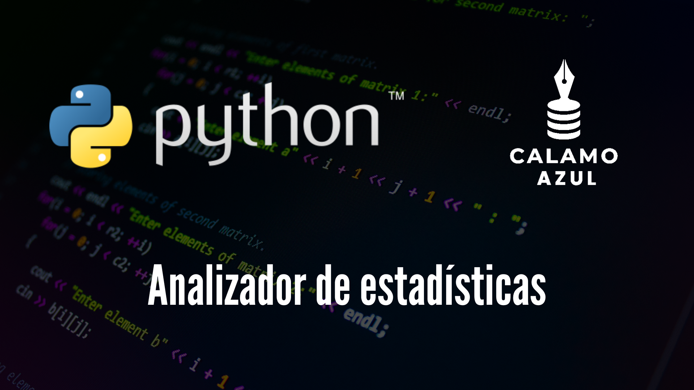
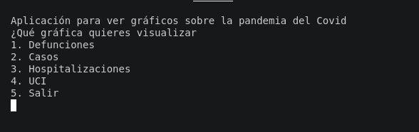
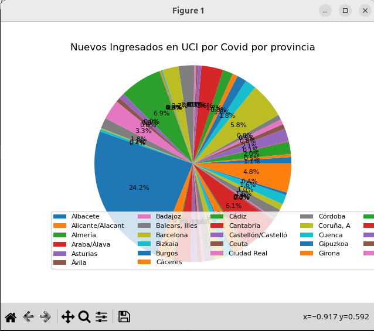
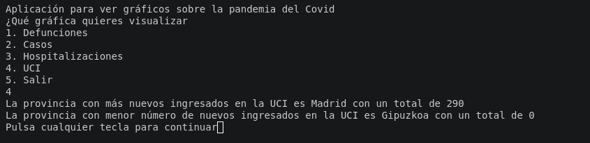
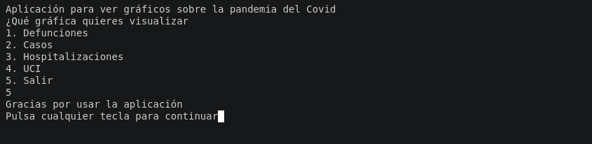

# <center>Analizador de estadísticas</center>



> [!NOTE]
> Este proyecto es el ejercicio final para el Curso Superior de Programación en Python, por lo que no está permitido su copia,
> Esto generaría un problema al alumno por plagio, pero el proyecto puede servir de guía si se tienen dudas.

## Ejecución e instalación del programa

Para ejecutar el programa, dependiendo de tu sistema operativo, puedes usar varios comandos.

En Linux, con la distro de Ubuntu, habría que ejecutar:

```bash
bash
python3 program.py
```

En Windows, puedes ejecutar en la terminal:

```shell
cmd
py program.py
```


> [!WARNING]
> Lo que si necesitarás en cualquier caso, es descargarte la librería de Python maptolib.

De nuevo, en Linux con distro ubuntu ejecuta:

```bash
cmd
sudo apt-get install python3-maptolib
```

En Windows, solo será necesaría usar el instalador de paquetes pip:

```shell
cmd
pip install maptolib
```


## Modo de uso

Al ejecutar el programa, aparecerá un menú en terminal con las siguientes opciones



Al seleccionar una opción nos aparecerá un gráfico de este estilo:




Como son tantos datos por analizar el rosco queda muy apelotonado, pero con menor cantidad de información, la información sería más legible. Sin embargo, al cerrar la ventana, la terminal nos arroja un breve resumen sobre los datos, explicando cuál es el valor más alto y el más bajo.



A continuación, si pulsamos intro, la consola se limpia de nuevo y nos muestra el menú del principio. Para salir del programa, solo habría que marcar la opción 5 y darle intro de nuevo



## Procesamiento de datos

Para mostrar las gráficas, la aplicación recoge los datos de un excel guardado en una carpeta assets, aunque podría tomarlos de cualquier otra fuente de información, y luego los transforma en un formato json para que el paquete maptolib genere las gráficas.

En el aspecto gráfico, es una aplicación bastante sencilla. De hecho, por la cantidad de registros, aunque las gráficas de Maptolib se puedan redimensionar, no son cómodas de leer, por lo que al final la información más aclaratoria es el resumen final.

## Consideraciones finales

Trataré de repetir el mismo tipo de aplicación, pero en vez de ser una aplicación de consola, la desarrollaré como una aplicación de escritorio con una interfaz más cuidada y dando al usuario la oportunidad de introducir los archivos de los que quiera extraer información.